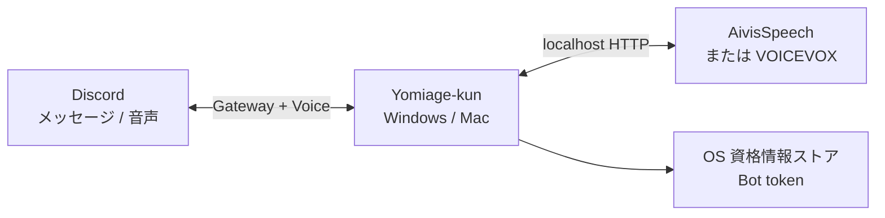

# Yomiage-kun

Discord のテキストチャットを、あなたの Windows / Mac から自然な日本語音声で読み上げるデスクトップアプリです。

> [!IMPORTANT]
> Yomiage-kun は **local-first / bring-your-own-bot** です。開発者が共有 Bot をホストする方式ではありません。利用者が自分の Discord Bot を作り、アプリを起動している間だけ自分の PC から接続します。月額サーバー費用、利用人数による従量課金、トークンの外部預託はありません。

## 特長

- Windows 11 と macOS 13 以降のネイティブデスクトップアプリ
- AivisSpeech / VOICEVOX の高品質なローカル音声合成
- `/join`、`/leave`、`/skip`、`/status` のシンプルな Discord 操作
- Discord Bot トークンを Windows Credential Manager / macOS Keychain に保存
- サーバーごとの有界キュー、メモリ内音声キャッシュ、絵文字・URL・メンションの正規化
- 音声ファイルをディスクへ書き出さないインメモリ再生
- ログイン時の自動起動と二重起動防止
- ウィンドウを閉じても動作を続けるタスクトレイ / メニューバー常駐
- 運営サーバー不要。Discord と音声エンジン以外へデータを送信しない

## 使い方

1. [Releases](https://github.com/yhay81/yomiage-kun/releases) から Windows または macOS 版をインストールします。
2. AivisSpeech または VOICEVOX をインストールし、エンジンを起動します。
3. Yomiage-kun の案内から Discord Developer Portal を開き、自分専用の Bot を作ります。
4. Bot トークンをアプリへ貼り付けて検証・保存し、表示されたボタンからサーバーへ追加します。
5. アプリで Bot を開始し、Discord のボイスチャンネルに入って `/join` を実行します。

初回セットアップの画面付き手順は [Discord Bot セットアップ](docs/discord-setup.md) を参照してください。Bot 作成後の日常操作は、音声エンジンと Yomiage-kun を起動して `/join` するだけです。

## 仕組み



合成結果はメモリから Discord Voice へ直接渡します。開発者が運営する API、データベース、Bot サーバーはありません。詳しくは [アーキテクチャ](docs/architecture.md) と [セキュリティ](docs/security.md) を参照してください。

## 対応環境

| 項目 | サポート |
|---|---|
| Windows | Windows 11 x64 |
| macOS | macOS 13 Ventura 以降（Apple Silicon / Intel） |
| 音声エンジン | AivisSpeech、VOICEVOX（VOICEVOX 互換 HTTP API） |
| Discord | Bot アカウント、Message Content Intent |
| Linux | コアライブラリは対応可能。デスクトップ配布は今後対応 |

## 開発

必要なものは Rust 1.97、Node.js 24 LTS、npm、プラットフォーム別の Tauri 2 ビルド環境です。

```powershell
npm --prefix apps/desktop ci
cargo test --workspace
npm --prefix apps/desktop run build
npm --prefix apps/desktop run tauri build
```

詳細は [開発ガイド](docs/development.md) と [コントリビューションガイド](CONTRIBUTING.md) を参照してください。

## ドキュメント

- [はじめに](docs/getting-started.md)
- [Discord Bot セットアップ](docs/discord-setup.md)
- [トラブルシューティング](docs/troubleshooting.md)
- [アーキテクチャ](docs/architecture.md)
- [セキュリティとプライバシー](docs/security.md)
- [開発ガイド](docs/development.md)
- [リリース手順](docs/releasing.md)
- [旧版からの移行](docs/legacy.md)

## ライセンス

[MIT License](LICENSE)
