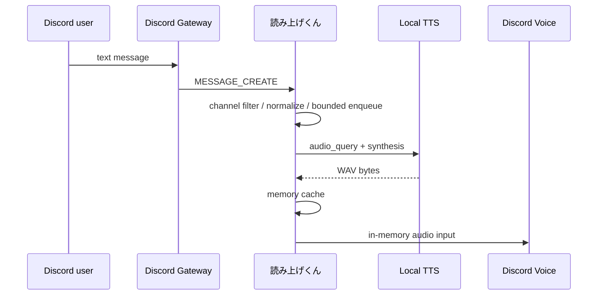

# アーキテクチャ

## 設計目標

1. 共有インフラを持たず、利用コストを利用者の PC 内で完結させる
2. Discord 投稿から再生開始までの待ち時間を短くする
3. 秘密情報と音声を永続化しない
4. Windows と macOS で同じコアロジックを使う
5. 外部障害や大量投稿が起きてもメモリ使用量を制限する

## 構成

```text
apps/desktop/
  src/                  Tauri WebView UI (TypeScript)
  src-tauri/            OS統合、Keychain、設定、Botライフサイクル
crates/yomiage-core/    設定、テキスト正規化、TTS、メモリキャッシュ
crates/yomiage-discord/ Discord Gateway、Slash Command、音声キュー
```

Tauri 2 の薄い UI と Rust のアプリケーションコアに分離しています。Discord は Serenity、Discord Voice は Songbird、非同期処理は Tokio を使用します。

## メッセージ処理



各 Guild は独立した有界 MPSC キューを持ちます。キューが満杯のときは新しい投稿を捨て、無制限にメモリを消費しません。URL、メンション、Discord 絵文字、Markdown、連続する `w` を読みやすい文字列へ正規化し、書記素クラスタ境界で安全に短縮します。

## 音声合成

`TtsProvider` trait により音声エンジンを分離しています。現在は AivisSpeech と VOICEVOX の互換 HTTP APIを使用し、`audio_query` と `synthesis` を呼び出します。出力は 48 kHz stereo に揃え、同じ本文・話者設定の合成結果を最大 128 MiB のプロセス内 LRU キャッシュに保持します。

一時 WAV ファイル、ffmpeg 子プロセス、ファイル監視ポーリングは使いません。音声バイト列を Songbird の入力へ直接渡します。

## 秘密情報と設定

- Bot token: Windows Credential Manager / macOS Keychain
- 非秘密設定: OS 標準のアプリ設定ディレクトリに JSON
- 音声キャッシュ: メモリのみ。プロセス終了時に消去
- ログ: トークン、投稿本文、音声データを出力しない

## 運用モデル

各利用者のデスクトップが Bot ホストです。開発者のコントロールプレーン、API、DB、キュー、オブジェクトストレージは存在しません。このため中央の月額費用は 0 で、1 利用者の大量利用が他利用者へ影響しません。一方、アプリを終了すると Bot もオフラインになります。

設計判断の背景は [ADR-0001](adr/0001-desktop-first.md) を参照してください。
